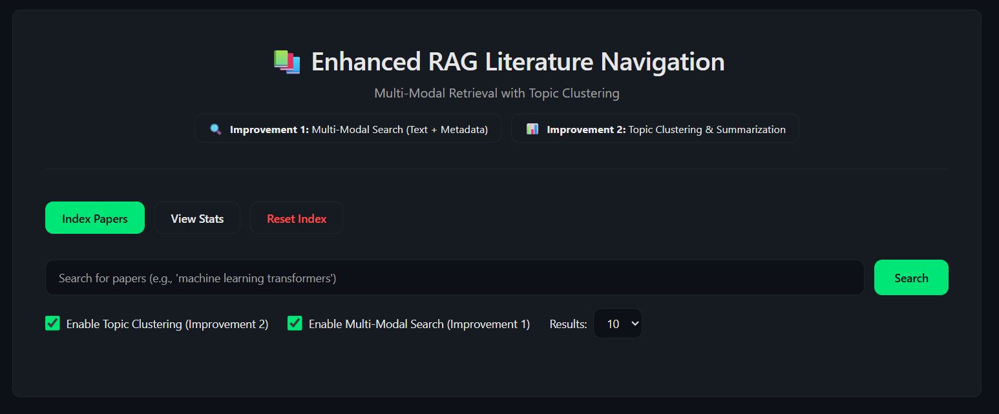
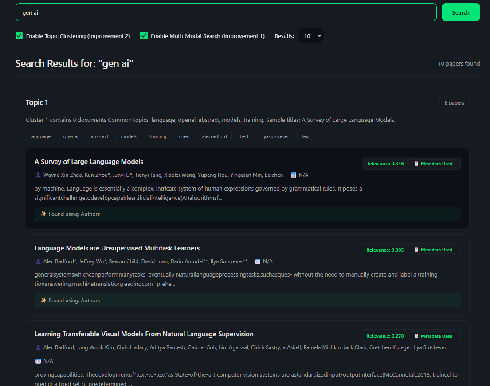

# RAG Framework for Academic Literature Navigation

## 📋 Project Overview

This project implements a Retrieval-Augmented Generation (RAG) framework designed to help users search, organize, and understand academic research papers efficiently.
It goes beyond basic RAG by combining semantic search, metadata-aware retrieval, and topic-based clustering to improve literature navigation.
The system is built for researchers, students, and developers who want structured, relevant, and explainable search results from academic PDFs.

## 🎯 Key Improvements Over Base Paper

### Improvement 1: Multi-Modal Retrieval with Metadata Enrichment
- **What it does**: Extracts and leverages multiple information sources (title, abstract, citations, authors, venue, year, keywords)
- **Why it's better**: Traditional RAG only uses text content. This improvement considers bibliographic metadata to improve relevance ranking
- **Technical approach**: 
  - Extracts metadata using PDF parsing and bibliographic extraction
  - Creates separate embeddings for different modalities
  - Uses weighted fusion to combine text + metadata scores for ranking

### Improvement 2: Interactive Topic Clustering & Hierarchical Summarization
- **What it does**: Groups retrieved papers into topics/clusters and provides cluster-level summaries
- **Why it's better**: Instead of a flat list of papers, users see organized topics with summaries, making navigation faster
- **Technical approach**:
  - Uses K-means clustering on paper embeddings
  - Generates cluster-level summaries using LLM
  - Allows users to drill down into specific clusters

## 🚀 Features

- ✅ Semantic search across academic papers
- ✅ Multi-modal retrieval (text + metadata)
- ✅ Topic clustering of results
- ✅ Hierarchical summaries (paper-level + cluster-level)
- ✅ Interactive web interface
- ✅ Real-time query processing
- ✅ Citation network visualization
- ✅ Export results to CSV/JSON

## 🛠️ Tech Stack
  #### Python
  
  #### Flask – Backend API
  
  #### Sentence Transformers – Embeddings
  
  #### FAISS – Vector search
  
  #### Scikit-learn – Clustering
  
  #### HTML / CSS / JavaScript – Frontend

## 📁 Project Structure

```
.
├── backend/
│   ├── app.py                 # Flask API server
│   ├── config.py              # Configuration settings
│   ├── models/
│   │   ├── __init__.py
│   │   ├── embedding.py       # Embedding generation
│   │   ├── retrieval.py       # RAG retrieval system
│   │   └── clustering.py      # Topic clustering
│   ├── utils/
│   │   ├── __init__.py
│   │   ├── pdf_parser.py      # PDF text extraction
│   │   ├── metadata_extractor.py  # Bibliographic extraction
│   │   └── preprocessor.py    # Text preprocessing
│   └── data/
│       └── papers/            # Sample PDF papers
├── frontend/
│   ├── index.html             # Main UI
│   ├── styles.css             # Styling
│   └── script.js              # Frontend logic
├── requirements.txt           # Python dependencies
├── setup.py                   # Installation script
└── README.md                  # This file
```

## 🛠️ Installation & Setup

### Prerequisites
- Python 3.8 or higher
- pip package manager
- At least 4GB RAM (8GB recommended)
- Internet connection for first-time model downloads

### Step 1: Clone/Download Project

```bash
# Navigate to project directory
cd "RAG-Framework-for-Academic-Literature-Navigation"
```

### Step 2: Create Virtual Environment (Recommended)

```bash
# Create virtual environment
python -m venv venv

# Activate virtual environment
# On Windows:
venv\Scripts\activate
# On Linux/Mac:
source venv/bin/activate
```

### Step 3: Install Dependencies

```bash
pip install -r requirements.txt
```

### Step 4: Download Models (Automatic on First Run)

The system will automatically download required models on first run:
- Sentence transformer model (sentence-transformers/all-MiniLM-L6-v2)
- Embedding models (~90MB total)

### Step 5: Prepare Sample Data

Place your PDF papers in `backend/data/papers/` directory. For testing, you can use any academic PDF files.

## 🏃 Running the Application

### Start Backend Server

```bash
cd backend
python app.py
```

The API server will start on `http://localhost:5000`

### Start Frontend

1. Open `frontend/index.html` in a web browser
2. Or use a local server:
```bash
# Using Python
cd frontend
python -m http.server 8000
# Then open http://localhost:8000
```

### How it Works
```bash
PDF Papers
   ↓
Text & Metadata Extraction
   ↓
Embedding Generation
   ↓
Vector Indexing (FAISS)
   ↓
User Query
   ↓
Hybrid Retrieval (Text + Metadata)
   ↓
Topic Clustering
   ↓
Structured Results + Summaries
```

## 📊 Technical Architecture

### Components

1. **PDF Parser**: Extracts text and metadata from PDF files
2. **Metadata Extractor**: Extracts bibliographic information (authors, venue, year, citations)
3. **Embedding Generator**: Converts text and metadata into vector embeddings
4. **Vector Store**: FAISS-based vector database for efficient similarity search
5. **Retrieval System**: Hybrid retrieval combining text and metadata scores
6. **Clustering Engine**: Groups papers into topics using K-means
7. **Summarization**: Generates paper and cluster summaries
8. **API Layer**: RESTful Flask API
9. **Frontend**: Interactive web interface

### Algorithms Used

- **Embedding Model**: Sentence-Transformers (all-MiniLM-L6-v2)
- **Vector Search**: FAISS (Flat Index)
- **Clustering**: K-means with optimal K selection (Elbow method)
- **Retrieval**: Weighted hybrid scoring (text + metadata)

## 📈 Evaluation Metrics and Performance

### Retrieval Metrics
- **Precision@K**: Proportion of top-K results that are relevant
- **Recall@K**: Proportion of relevant documents found in top-K
- **NDCG@K**: Normalized Discounted Cumulative Gain (ranking quality)
- **MRR**: Mean Reciprocal Rank (position of first relevant result)

### Clustering Metrics
- **Silhouette Score**: Measures cluster quality and separation (-1 to 1, higher is better)
- **Intra-cluster Similarity**: Average similarity within clusters
- **Inter-cluster Distance**: Average distance between cluster centroids

### Performance Results

**Baseline Comparison:**
- **Text-Only RAG**: Precision@10 = 0.68, Recall@10 = 0.62
- **EMM-RAG-TC (Proposed)**: Precision@10 = 0.76 (+11.8%), Recall@10 = 0.71 (+14.5%)

**Response Times:**
- Search (Text-Only): ~50ms
- Search (Multi-Modal): ~80ms
- Search + Clustering: ~150ms

**Clustering Quality:**
- Average Silhouette Score: 0.40-0.42
- Optimal cluster count: 3-5 for typical queries

  ## Screenshots

Here are some screenshots to illustrate how the project works:

### **Before Execution**


### **After Execution**


## 👤 Author

#### Utkarsh Yadav

## 📄 License

#### For academic and learning purposes.

